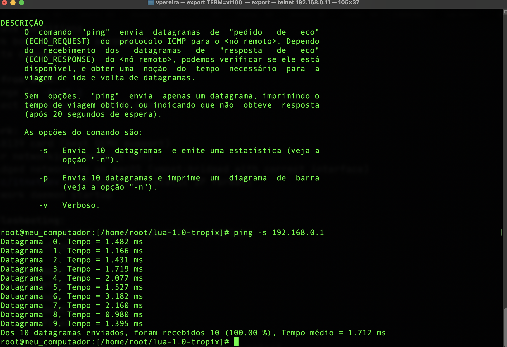
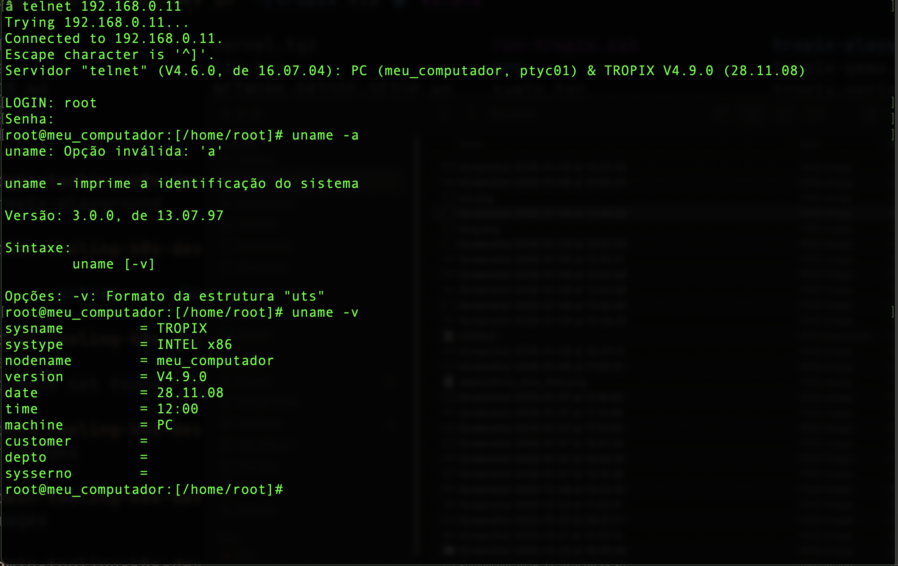
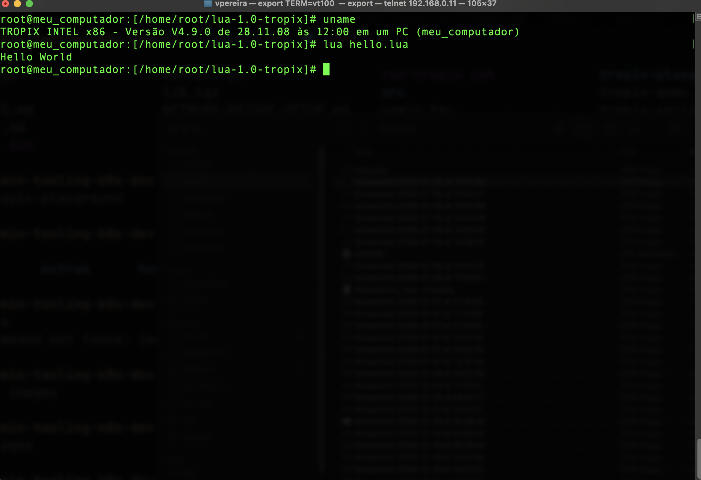

# Tropix Development Guide

Those tips should end up in the Wiki

Running Tropix OS 4.9.0 in QEMU on modern systems.

## Prerequisites

- QEMU (macOS: `brew install qemu`)
- Tropix ISO (`tropix.iso`)
- For bridged networking on macOS: QEMU with vmnet support

## Quick Start

### Create disk image

```bash
qemu-img create -f qcow2 tropix-disk.qcow2 512M
```

### Boot from CD

```bash
qemu-system-i386 \
  -m 128 \
  -cpu 486 \
  -cdrom tropix.iso \
  -hda tropix-disk.qcow2 \
  -boot d \
  -netdev user,id=net0 \
  -device rtl8139,netdev=net0 \
  -rtc base=localtime
```

Key parameters:
- `-m 128` - 128MB RAM required (32MB causes boot hang at 6%)
- `-cpu 486` - Use 486, not Pentium (timing issues)
- `-boot d` - Boot from CD-ROM
- `-device rtl8139` - Network card (best QEMU support)

### Installation

Boot process and partitioning instructions are in `install.txt`. Quick summary:

1. At boot prompt: `boot> -i` (decompresses filesystem to RAM)
2. Login: root/tropix
3. Partition with fdisk: `boot> -f` (see install.txt for details)
4. Run installer: `cd /usr/etc/install && install`
5. Mark root partition bootable in fdisk
6. Change to `-boot c` and reboot
7. Enable multi-user model with CTRL+D. You should see a login prompt.

Refer to `install.txt` for complete installation procedure.

## Build a Bootable ISO from Source

This section describes how to build a custom `tropix.iso` after making changes to the codebase.

I just opened the iso and looked into

### ISO Structure Overview

The bootable ISO contains these key files:

| File | Size | Description | Source |
|------|------|-------------|--------|
| `boot.cd` | ~432 bytes | El Torito boot image | `kernel/boot/boot1/cd.boot1` |
| `boot` | ~141 KB | Stage 2 bootloader | `kernel/boot/boot2/boot` |
| `boot.gz` | ~9 MB | Compressed root filesystem (32MB uncompressed) | T1 filesystem image |
| `tropix` | ~576 KB | Kernel binary | `kernel/kernel/tropix` |
| `install.txt` | ~110 KB | Installation guide | `install.txt` |
| `winsys/` | optional | X Window System files | X11 distribution |

### Boot Process

1. **BIOS** reads the ISO and loads the El Torito boot image (`boot.cd`)
2. **boot1** (CD variant) displays version, prompts for boot2 filename, loads `boot`
3. **boot2** at `boot>` prompt, accepts flags like `-i` to decompress `boot.gz` to RAM
4. **Kernel** boots with the decompressed T1 filesystem as a RAM disk (`/dev/ramd0`)

### Build Steps (on Tropix VM)

Adjust paths if sources are not under `/usr/src` or `/src/sys/tropix/pc`.

#### Step 1: Build Boot Loaders

```bash
# Build all boot stages
cd /usr/src/kernel/boot
make

# Or build individually:

# boot1 for CD (produces cd.boot1)
cd /usr/src/kernel/boot/boot1
make cd.boot1

# boot2 (produces boot)
cd /usr/src/kernel/boot/boot2
make

# Install to /etc/boot/ (optional, for installed system)
cd /usr/src/kernel/boot
make cp
```

#### Step 2: Build the Kernel

```bash
cd /usr/src/kernel/kernel
make

# Install to /tropix (optional)
make cp
```

**Tip:** If `ld` fails with "Erro na escrita da seção TEXT", increase `/tmp` RAM disk size:
```bash
edscb /tropix
ramd0sz=4096
w
# Then reboot
```

#### Step 3: Build Libraries (if modified)

```bash
cd /usr/src/lib
make
make cp
```

#### Step 4: Build Commands (if modified)

```bash
# Build all commands (copies only changed files)
cd /usr/src/cmd
make cmpqcp

# Or build a single command
cd /usr/src/cmd/<name>
make
make cp
```

#### Step 5: Create boot.gz (Root Filesystem Image)

Boot2 expects a gzip-compressed T1 filesystem image. The CD boot allocates 32 MB for it.

```bash
# Create a 32MB T1 filesystem in a regular file
# 65536 blocks * 512 bytes = 32MB
mkfst1 -r -f /tmp/boot.img 65536 "TROPIX_BOOT" "ramd0"

# Mount the image
mount /tmp/boot.img /mnt

# Copy the complete root filesystem
# Option A: Copy from running system
cptree / /mnt

# Option B: Copy from a prepared rootfs directory
cptree /path/to/rootfs /mnt

# Ensure essential files exist:
# /tropix, /etc/init, /etc/fstab, /etc/passwd
# /bin/sh, /bin/login, /lib/libt.o
# /dev/console, /dev/null, /dev/ramd0

# Unmount
sync
umount /mnt

# Compress the image
gzip -9 /tmp/boot.img
# Result: /tmp/boot.img.gz (~9MB)
```

**Minimal boot.gz contents:**
```
/tropix              # Kernel
/etc/init            # Init configuration
/etc/fstab           # Filesystem table
/etc/passwd          # User database
/etc/boot/           # Boot files
/bin/sh              # Shell
/bin/login           # Login program
/lib/libt.o          # Shared library
/dev/console         # Console device
/dev/null            # Null device
/dev/ramd0           # RAM disk device
```

#### Step 6: Assemble ISO Contents

Gather all files into a staging directory:

```bash
mkdir -p /tmp/iso

# Boot files
cp /usr/src/kernel/boot/boot1/cd.boot1 /tmp/iso/boot.cd
cp /usr/src/kernel/boot/boot2/boot /tmp/iso/boot

# Kernel
cp /usr/src/kernel/kernel/tropix /tmp/iso/tropix

# Compressed filesystem
cp /tmp/boot.img.gz /tmp/iso/boot.gz

# Documentation
cp /usr/doc/install.txt /tmp/iso/install.txt

# Optional: X Window System
mkdir -p /tmp/iso/winsys
cptree /usr/xwin /tmp/iso/winsys/
```

#### Step 7: Create the ISO (on Linux/macOS host)

Tropix does not include an ISO authoring tool (i found some under cmd, i have to test it). Transfer files to your host system.

**Using mkisofs (genisoimage):**
```bash
cd /path/to/iso_contents
mkisofs -v -o tropix.iso -V TROPIXBOOT -J -R -b boot.cd -no-emul-boot .
```

**Using xorriso:**
```bash
cd /path/to/iso_contents
xorriso -as mkisofs -v -o tropix.iso -V TROPIXBOOT -J -R -b boot.cd -no-emul-boot .
```

**Options explained:**
| Option | Description |
|--------|-------------|
| `-v` | Verbose output |
| `-o tropix.iso` | Output filename |
| `-V TROPIXBOOT` | Volume label (**must be TROPIXBOOT**) |
| `-J` | Generate Joliet extensions (Windows compatibility) |
| `-R` | Generate Rock Ridge extensions (Unix compatibility) |
| `-b boot.cd` | El Torito boot image filename |
| `-no-emul-boot` | No disk emulation (boot image loaded directly) |

#### Step 8: Test the ISO

```bash
qemu-system-i386 \
  -m 128 \
  -cpu 486 \
  -cdrom tropix.iso \
  -boot d
```

At the `boot>` prompt, type `-i` to decompress the filesystem to RAM and boot.

### Transferring Files Between Host and Tropix

**Option 1: FTP (if network configured)**
```bash
# From Tropix, connect to host FTP server
ftp <host-ip>
```

**Option 2: Shared FAT disk image**
```bash
# On host: create FAT image
dd if=/dev/zero of=shared.img bs=1M count=100
mkfs.vfat shared.img

# Add to QEMU command:
-hdb shared.img

# In Tropix:
mount /dev/hdb1 /mnt
```

**Option 3: Extract from mounted ISO**
```bash
# Mount original ISO in Tropix
mount /dev/hdb /cdrom   # if CD-ROM is second drive
```

### Quick Reference

| Task | Command |
|------|---------|
| Build all boot stages | `cd kernel/boot && make` |
| Build CD boot sector | `cd kernel/boot/boot1 && make cd.boot1` |
| Build boot2 | `cd kernel/boot/boot2 && make` |
| Build kernel | `cd kernel/kernel && make` |
| Build all commands | `cd cmd && make cmpqcp` |
| Create T1 filesystem | `mkfst1 -r -f <file> <blocks> <volname> <devname>` |
| Copy directory tree | `cptree <src> <dst>` |
| Create device node | `mknod <name> c|b <major> <minor>` |
| Compress file | `gzip -9 <file>` |

### ISO Build Troubleshooting

| Problem | Solution |
|---------|----------|
| ISO doesn't boot | Verify `boot.cd` exists and volume label is `TROPIXBOOT` |
| "Arquivo BOOT nao encontrado" | `boot` file missing from ISO root |
| Kernel panic on boot | Check `boot.gz` has all required files and `/dev` nodes |
| "Erro na escrita" during kernel build | Increase `/tmp` RAM disk size via `edscb` |
| Boot hangs at percentage | Ensure `-m 128` (128MB RAM) in QEMU |

## Network Configuration

### Supported Cards

RTL8139 (Realtek) works reliably. 

### QEMU Network Modes

**User networking (NAT):**
```bash
-netdev user,id=net0 -device rtl8139,netdev=net0
```
VM gets 10.0.2.15, isolated from host network.

**Bridged networking (macOS):**
```bash
-netdev vmnet-bridged,id=net0,ifname=en7 -device rtl8139,netdev=net0
```
Requires sudo. Replace `en7` with your active interface (`ifconfig`).

### Tropix Network Setup

Edit `/etc/itnetdev`:

Static IP configuration:
```
name_server 192.168.0.1 8.8.8.8
/dev/rtl0 192.168.0.11
netmask=255.255.255.0 default
```

Format: device + IP on one line, netmask on next. The `default` keyword creates gateway route (network+1).

DHCP may work but static IP is more reliable:
```
/dev/rtl0 dhcp
```

Reboot or kill the itnet daemon:

```
kill $PID # ps aux is your friend
```

Verify:
```bash
editscb -t    # routing table
ping 8.8.8.8  # connectivity
ping google.com # name resolution
```



## Remote Access

Telnet to VM once network is configured:
```bash
telnet <tropix-ip> 23
```

Make sure you have the correct encoding (Latin-1) enabled on your terminal. Set your TERM to vt100



Default credentials: root/tropix

Available services:
- Telnet (port 23)
- FTP (port 21)
- SMTP (port 25)
- FINGER (port 79)
- HTTP (port 80)
- POP3 (port 110)
- RSYNC-Like (port 117)
- RLOGIN (port 513)

## Development Tools

Tropix includes:
- C compiler (`cc`)
- Make, ld, as
- Text editors (vi, ed)
- Lua interpreter
- Standard Unix utilities (awk, sed, grep, etc.)
- Dont use tar in tropix, instead gar. There is some incompatibility with the tar from mac. 
- `rm -rf` does not delete directories; use `rmtree -f` for non-empty directories and `rmdir -f` for empty ones.



## Building and Installing

There is no global `make install`. Each package uses `make cp` (or `cmpqcp`) to copy built artifacts into the system tree.

### libc

Build and install the full libc:
```bash
cd lib/libc
make
make cp
```

Install a single syscall wrapper:
```bash
cd lib/libc/sys/<name>/pc
make
make cp
```

### cmd

Build and install a single command:
```bash
cd cmd/<name>
make
make cp
```

Build and install all commands (copy only when different):
```bash
cd cmd
make cmpqcp
```

### Kernel build tip: /tmp RAM disk size

The kernel link step uses temporary files. If `/tmp` is too small (RAM disk),
`ld` may fail with errors like “Erro na escrita da seção "TEXT"”.

Increase the RAM disk size via `edscb` (values are in KB), then reboot:
```bash
edscb /tropix
ramd0sz=4096
w
```

### Shared library (`/lib/libt.o`) refresh

`cc` links against the shared library `/lib/libt.o` by default. After adding a new
libc symbol (like a syscall wrapper), rebuild and reload `libt.o` or reboot:
```bash
cd cmd/ld
make
make libt.o
cp libt.o /lib/libt.o
```
Reload without reboot (use `ldshlib` to find the index):
```bash
ldshlib -v
ldshlib -u <index>
```


## Troubleshooting

**vmnet errors on macOS:** Run with sudo if you want to access the network on your host.
Check QEMU has vmnet support: `qemu-system-i386 -netdev help | grep vmnet`

**Partition not bootable:** Use fdisk (`boot> -f`), activate with `a` command, write with `w`.

**ISO doesn't boot:** Verify `boot.cd` exists in ISO root and volume label is exactly `TROPIXBOOT`.

**"Arquivo BOOT nao encontrado":** The `boot` file (boot2 bootloader) is missing from the ISO root.

**Kernel panic on boot:** Ensure `boot.gz` contains all required files and device nodes.

**"Erro na escrita da seção TEXT":** Increase `/tmp` RAM disk size via `edscb`, then reboot.

**Boot hangs at percentage:** Ensure QEMU has at least 128MB RAM (`-m 128`).

## Files

- `install.txt` - Complete installation guide (Portuguese)
- `scripts/run-tropix.zsh` - QEMU launcher script
- `kernel/` - Kernel and bootloader source code
- `kernel/boot/boot1/cd.boot1.s` - CD-ROM boot sector source
- `kernel/boot/boot2/` - Stage 2 bootloader source
- `kernel/kernel/` - Kernel source
- `lib/` - System libraries (libc, libcurses, libm486, libxti)
- `cmd/` - User commands and utilities
- `sxwin/` - X Window System


Happy hacking and Have a lot of fun!
